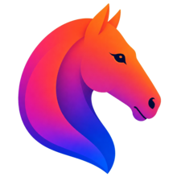
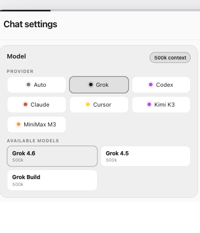
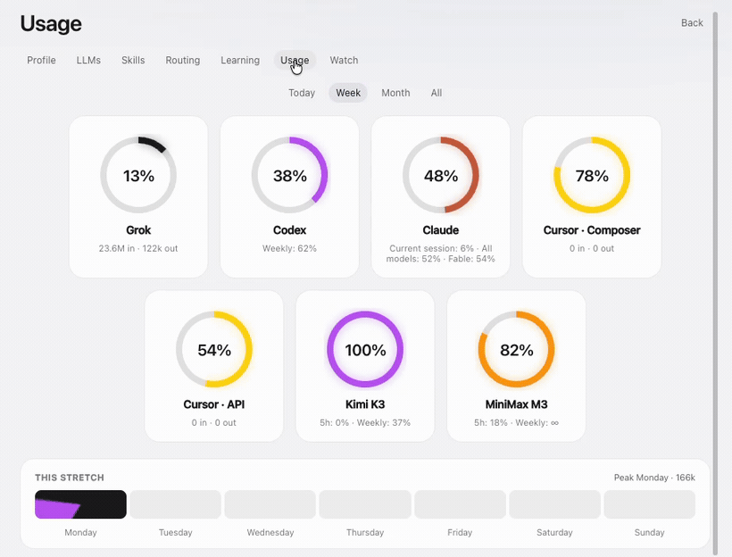
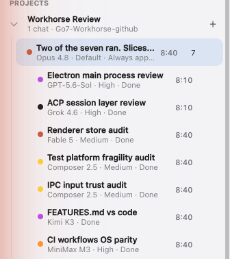
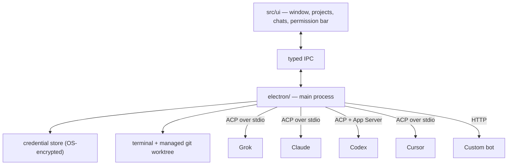

<p align="center">
  
</p>

<h1 align="center">Go7 Workhorse</h1>

<p align="center"><strong>One desk. Every Subscription.</strong></p>

Run Grok, Claude, Codex, Cursor, your own API keys and your local models in one
window. Each keeps its own login. Usage and costs are all tracked.

Cursor puts a model in your editor. Workhorse puts your existing models to work.

- **Pick a model per chat.** Orchestration first.
- **Monitor spend.** Usage is tracked per bot and per chat, against exact budget
  and weekly pace rate.
- **Nothing is shared.** No pooled subscriptions, context or sandboxes.
- **Bring your own.** Any Anthropic or OpenAI-compatible endpoint counts,
  including one on your own machine.
- **It learns.** A private store on your disk, which you can export or wipe.
- **Work survives a restart.** Queues, schedules and goals are journalled.

## Who it's for

You pay for more than one of these — Grok on any plan, Claude, Codex, Cursor,
or an API key for a hosted or local model — and each sits idle while you work
in the other. Workhorse is one place to pick which one does each job, and to
see what each has left this week.

**Why it exists.** It began at a desk paying for SuperGrok Heavy, Cursor,
Claude and Codex, where one plan ran dry most days while another sat idle. The
sharpest case is Grok with Cursor: a Grok plan and a Cursor plan each give you
Grok 4.6, on separate meters. Workhorse treats them as one model with two
pools — it shows both meters, moves a chat between them, and with auto-route
on leans each task toward the pool with more left. So a plan you already pay
for gets used before another is spent. The same holds for any two
subscriptions that overlap.

**A good fit if**

- You hold two or more AI subscriptions or API keys.
- You want the routing choice to be yours: a model per chat, or auto-route by
  task with a reserve you set.
- You want the work to run on your machine, under your own logins.

**Not a fit if**

- You use one vendor and are happy in its own app.
- You want a hosted service. This is a desktop app. There is no account with
  us and no server of ours.
- You need Linux today. Installers ship for Windows and macOS. Linux builds
  and tests in CI but has no installer yet.

**What it does with your accounts**

- Each vendor runs through its own CLI or API, under its own login. Nothing is
  pooled, proxied, or shared between vendors.
- API keys go in the OS credential store — Keychain on macOS, DPAPI on
  Windows — never in plain text. If that store is unavailable the app refuses
  to save the key at all.
- It talks to the vendors you connect, including their usage endpoints for
  the meters, and to GitHub to check for a newer release. It sends no
  analytics.
- Learning memory is a SQLite file on your disk. Export it or wipe it from
  Settings.

**Evaluating it for someone else?** One question decides it: do they hold more
than one AI subscription or API key? If yes, this is built for them. The lists
above are exact, [`docs/FEATURES.md`](docs/FEATURES.md) is every ability it
has, and all of it is in this repo under MIT — nothing here needs to be taken
on trust.



*One chat, four providers. Kimi K3 and MiniMax M3 in that list are custom bots,
added with a URL and a key.*



*Real meters, read from each vendor's own numbers. The daily bank hands every
bot a slice of its plan per day and carries forward what it did not spend, so a
long Monday does not leave Sunday with nothing.*



**One brief, seven workers.** The orchestrator wrote a lineup and spawned every
bot on the desk at once — Codex, Grok, Claude, Cursor twice, and two custom
bots — at three effort levels, each in its own chat with its own slice. When the
last one finished, the desk joined their reports into one ranked list.

That is the desk reviewing its own repository. Two of the fixes it found are
already on `main`.

<br clear="right">

Grok, Claude and Cursor speak ACP. Codex adds an App Server for native history.
Custom bots are plain HTTP.

## How it fits together

Each vendor runs as its own process. The window never touches a vendor CLI. It
speaks typed IPC to Electron main, which owns the adapters, prompts, credentials
and working directory.



Each adapter runs the vendor's own CLI, under the login you already hold.

## Contributing

Repository shape and versioning rules are in [CONTRIBUTING.md](CONTRIBUTING.md).

## What it does

Every ability is listed in [docs/FEATURES.md](docs/FEATURES.md).

## Goal

See [GOAL.md](GOAL.md). In short: a learnable Apple-like desktop shell, not a website, not a new model.

## Run

```bash
cd path\to\Go7-Workhorse
npm install
npm run dev
```

`npm run dev` opens the **Go7 Workhorse window**. It does not use Chrome as the app.

## Install on Windows

```bash
npm install
npm run dist:win
```

Run `release/Go7-Workhorse-Setup-<version>.exe` to install the branded **Go7 Workhorse** desktop application. The installer creates Start-menu and Desktop shortcuts and preserves existing projects and chats when updating or uninstalling.

## Install on macOS

Take the latest release:

```bash
curl -fsSL https://raw.githubusercontent.com/go7studio/Go7-Workhorse/main/scripts/install-mac.sh | bash
```

Or build it yourself:

```bash
npm install
npm run dist:mac
```

On a Mac, that writes `release/Go7-Workhorse-<version>-mac.dmg`, `release/Go7-Workhorse-<version>-mac.zip`, and the unpacked `Go7 Workhorse.app`. Local packages use a separate development vault and should not be distributed. Release builds require the `MAC_CSC_*` signing secrets and `MAC_APPLE_*` notarization secrets. Vendor CLIs are not bundled.

macOS approval belongs to the signed app identity. One allow sticks across updates with the same bundle ID and Team ID. Local builds cannot open the installed app's vault. Windows keeps the same app identity and encrypted user vault across updates.

## How to use the scaffold

1. **New project** — give it a name. No folder required.
2. **Chat** from that project, or **New chat** from the welcome screen (creates an Untitled project).
3. **Link folder** or **Add reference** when you want files, URLs, or notes on the project. Several folders are allowed.
4. **New chat** starts with the last model. Change vendor, model, and brain level from the menu on the composer.
5. **Talk** — Grok, Codex, and Claude run live. Custom uses the HTTP bot you created.
6. **Type `/`** — command palette.
7. **`/demo-permission`** — shows Allow once / Allow for session / Deny.
8. **Review / Terminal** — inspect the real Git working tree or open a shell scoped to this chat's local folder or worktree.

| Command | What it does |
|---|---|
| `/new` | Back to this project’s home |
| `/project` | Create a project |
| `/link` | Link a folder to this project |
| `/providers` | Back to the project home |
| `/ask` `/accept-edits` `/always-approve` | Permission mode |
| `/theme` | Light, dark, or system |
| `/model` | Switch model (`/model grok-4.6`) |
| `/effort` | Brain level (`low` `medium` `high` `extra`) |
| `/settings` | Profile, connected LLMs, custom API, usage |
| `/usage` | Open Settings → Usage |
| `/schedule 30m …` | Persist a one-shot background run and execute it in this chat when due |
| `/schedule every 30m …` | Create a recurring, restart-safe background run |
| `/compact` | Compact natively when available, otherwise create a portable Workhorse checkpoint |
| `/goal objective` | Start a quiet Workhorse goal; use `pause`, `resume`, `status`, or `clear` without adding control turns to the transcript |
| `/quit` | Close the app |

## Layout

```
electron/     window, folder dialog, saved state
src/lib/      types, store, commands, provider list
src/ui/       sidebar, welcome, project home, chats, sheets
src/styles/   tokens and layout
```

State is saved under Electron `userData` as a versioned `workhorse-state.json`. Writes are atomic, three protected backup generations are retained, older saves migrate on load, and a corrupt primary falls back to the newest compatible backup. Custom API keys are removed from normal state and backups and stored through Electron's OS-backed encrypted storage. The app refuses to persist a plaintext key when OS encryption is unavailable.

Grok chats use `grok agent stdio`. Codex chats use `@agentclientprotocol/codex-acp` (or `CODEX_ACP_BIN`) with `CODEX_PATH` pointed at the installed `codex.exe`; when that CLI exposes `codex app-server`, Settings can also show native Codex threads, child-thread relationships, hooks, and runtime capabilities. Claude chats use `@agentclientprotocol/claude-agent-acp` (or `CLAUDE_ACP_BIN`) with `CLAUDE_CODE_EXECUTABLE` pointed at the installed `claude.exe`. Cursor chats use the Cursor CLI (`agent acp`, or `CURSOR_ACP_BIN`) and your existing Cursor login. Custom chats call any Anthropic/OpenAI-compatible URL the user adds. Usage for Cursor splits Cursor Models (Composer / Cursor Grok) from Other Models (third-party API include).

Each chat can execute in the linked local folder or a managed detached Git worktree. Permission mode, filesystem sandbox, network access, and outside-workspace/root access are separate settings. Workhorse applies the shared security boundary before translating an approval to a vendor; Codex also receives supported controls through its native config.

## Provider-neutral harness features

- A canonical portable transcript follows a chat when its provider changes, and portable checkpoints restore compacted context for providers without native compaction.
- The provider capability registry drives controls instead of implying that every vendor supports the same native operations.
- Custom Anthropic Messages and OpenAI Chat Completions bots can use configured MCP servers through the same normalized approval and result path as built-in tools.
- Electron main journals queues, one-shot and recurring schedules, and active goals. Dispatched work is recovered after an app-process restart.
- Cross-provider subagents have explicit lifecycle records, runtime and token ceilings, cascading cancellation, changed-file review, shared-workspace conflict warnings, and managed-worktree isolation when the project supports it.
- The sidebar searches chat titles and message text across projects. Its attention inbox retains permission requests, failed scheduled work, failed subagents, and conflict warnings until dismissed.
- Settings can export a support-safe provider report. It excludes prompts, messages, file contents, environment variables, URLs, and credential values.

Custom OpenAI-compatible HTTP support intentionally targets Chat Completions. This project does not implement the OpenAI Responses API or Azure OpenAI deployment routing.

Run `npm run build` for the production TypeScript/Vite build and `npm test` for the complete adapter and shell suite.

## Evaluation baseline

The Workhorse-specific reusable eval kit lives in [`eval/`](eval/README.md).
It covers first-run harness discovery, projects/chats, provider and model
identity, interoperable commands, permissions/sandboxing, continuity, usage,
and install/recovery. `npm run eval:validate` checks the suite directly, and
the production build runs that validation so new core commands or Settings
sections cannot silently drift out of the audit contract. The baseline is
defined but deliberately unrun until the next approved build is ready.
