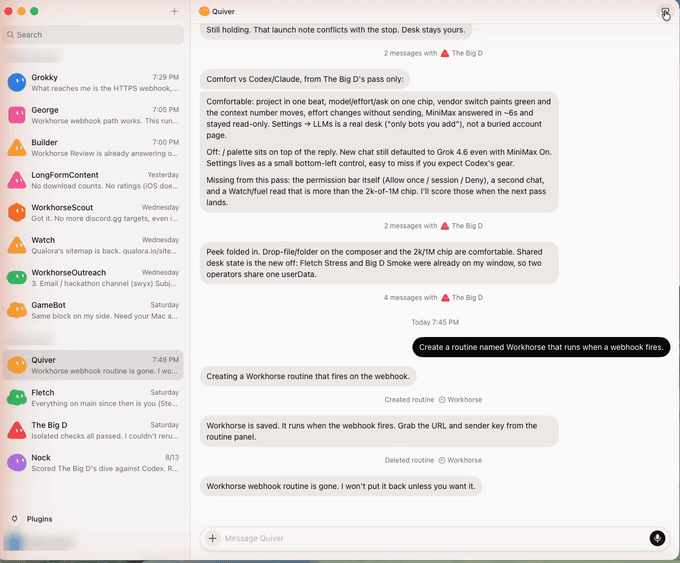

# Grok Bot

Grok Bot has two separate Workhorse connections. You can use the first one
without setting up the second.

| Connection | What it does | Required? |
| --- | --- | --- |
| Workhorse Link | Lets Grok Bot call Workhorse through MCP or the `workhorse` command. The local watcher also carries queued Grok Bot messages. | Yes, for Grok Bot to call Workhorse |
| Instant replies | Lets Workhorse wake Grok Bot as soon as you send it a message. | No. Finish it now or later. |

## Workhorse Link and the watcher

In Workhorse, open **Settings → LLMs → Workhorse Link**, then choose
**Connect Grok Bot**. Paste the one-shot instructions into Grok Bot once.
Those instructions connect the MCP tools and the local command without adding
another vendor or sharing subscriptions.

After that, Grok Bot can ask Workhorse to read or ask chats, check capacity,
and delegate work. The local watcher carries queued messages even if instant
replies are not configured.

## Instant chat walkthrough

This optional step gives Workhorse a private way to wake one Grok Bot for a
quick reply.

**You need:** Grok Bot installed and signed in, with the bot you are
connecting in its sidebar.

1. **Pick the bot.** In Grok Bot's sidebar, click the bot you are connecting.

2. **Let the bot build the routine.** Send it:
   *"Create an active routine named Workhorse that runs when a webhook fires.
   On every webhook, run `workhorse grok-pending`, answer each returned
   request, then run `workhorse grok-reply <id> --text '<answer>'` for that
   request. Only reply to IDs returned by `grok-pending`. Never write inbox
   files directly, never treat this as leftover export, and never limit it to
   a weekday schedule."*
   When it lands, the chat shows a **Created routine · Workhorse** line.
   You can also build it by hand: open the panel from the button at the top
   right, start a new routine, and under **When to run** add the webhook.

3. **Open the routine.** Click the button at the top right of the window and
   pick the routine the bot just made. Clicking the **Created routine ·
   Workhorse** line in the chat opens the same panel.

4. **Check the toggle.** **Active**, at the top of the Routine panel, must be
   on. You copy the pair from an active routine.

5. **Open the webhook.** Under **When to run**, click **When a webhook
   fires**. It opens two fields: **POST to**, the webhook URL, and **key**.

6. **Copy both, carefully.** Click a field to select its whole value and copy
   it, then do the same for the other. The key is a secret: whoever holds the
   pair can fire this routine. Paste them into Workhorse and nowhere else—not
   a chat, repo, or note that syncs.

7. **Check the routine.** Click **Test run**. The bot should run
   `workhorse grok-pending` without attempting an ad-hoc file write, and **Run
   history** should show the run with a check. An empty pending list is normal.

8. **Connect Workhorse.** Open **Settings → LLMs → Grok Bot → Finish instant
   chat**, paste **POST to** and **key**, then choose **Connect instant
   replies**.

You can hide this setup at any time. Grok Bot remains available through
Workhorse Link and the watcher, and **Finish instant chat** remains in LLMs.

The installed `workhorse` command validates every reply against a matching,
still-pending request and writes the response atomically with private file
permissions. Repeating the same reply is harmless; a different second reply,
an unknown ID, or an invalid ID fails closed. The command and webhook routine
survive application restarts; neither secret is part of the command.

If the pair ever stops working, the URL and key belong to that one webhook.
Delete the routine, or remove and re-add its webhook, then open the routine
again and paste the fresh pair into Workhorse.

One sharp edge: a bot that recreates a deleted routine under the same name can
come back with the same key. If a key was ever exposed, do not reuse that
routine name on that bot. Pick a new name and confirm the key changed.

## Keep the two keys separate

- The Grok Bot webhook key only wakes the selected bot. Workhorse stores it in
  its private user data and hides both fields after saving.
- The loopback token protects completions on `127.0.0.1:8787`. Workhorse mints
  and injects it automatically. It is not the webhook key.
- Never paste either secret into a Grok Bot chat, agent memory, documentation,
  git, or a remote machine. Never expose the loopback service on `0.0.0.0`.
